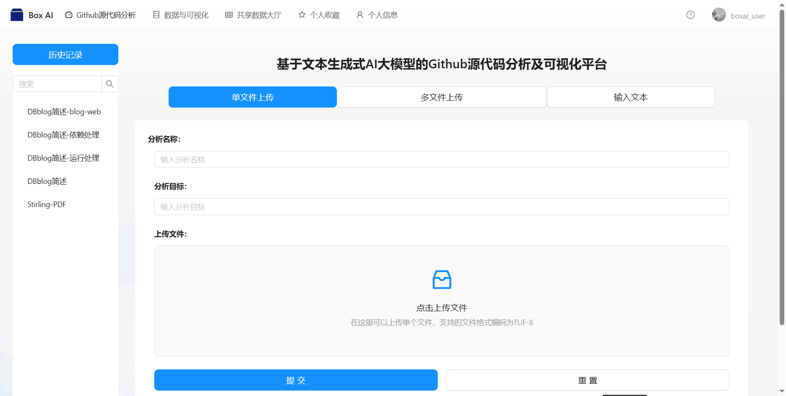
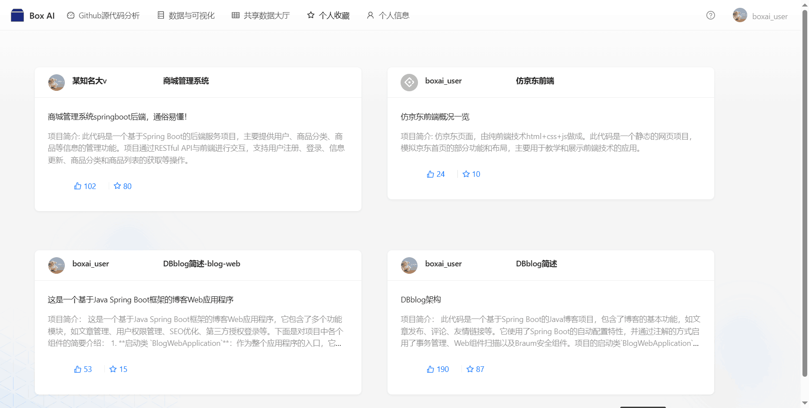
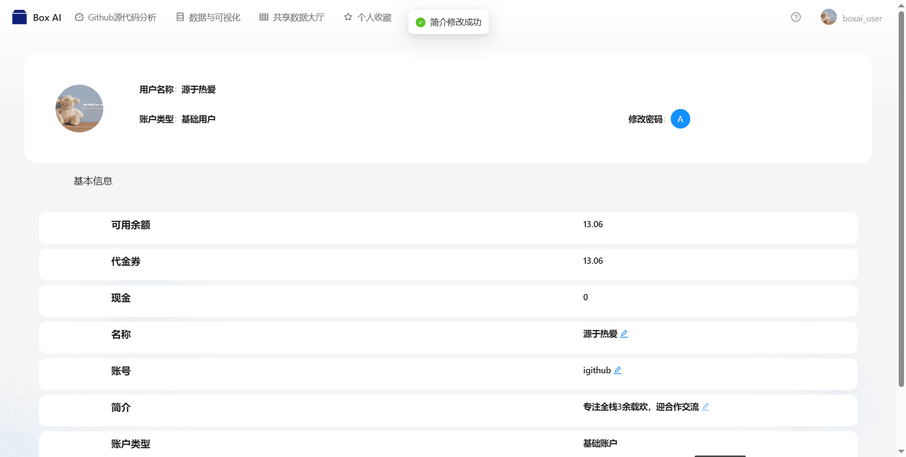
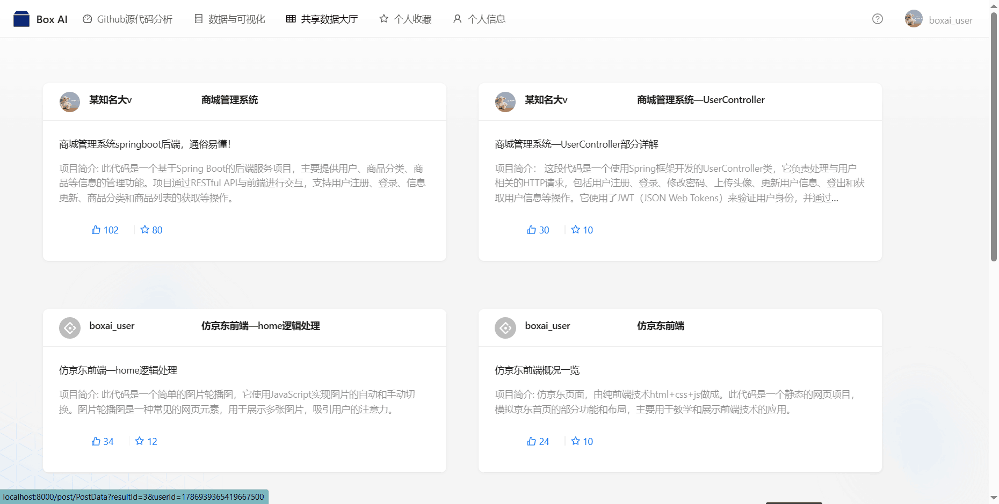
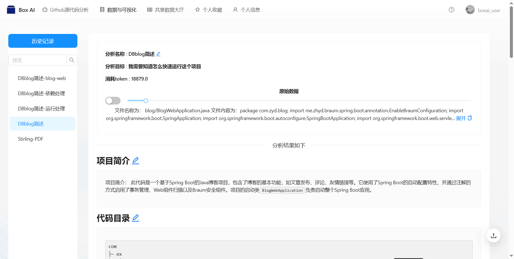
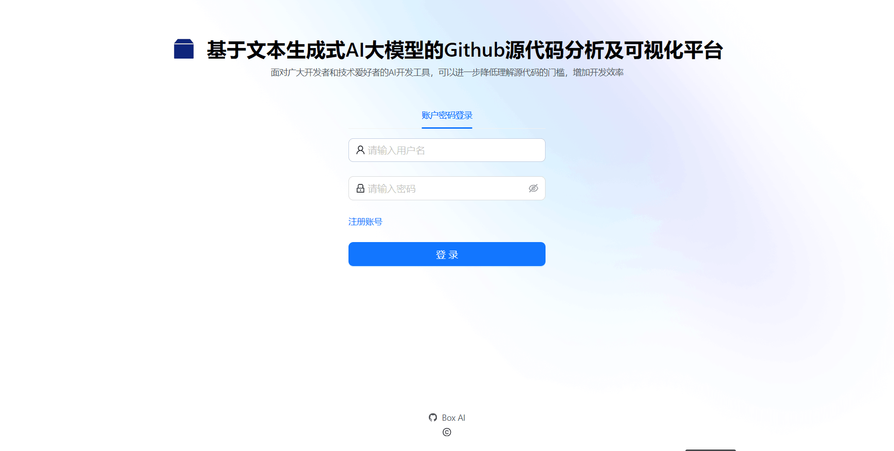
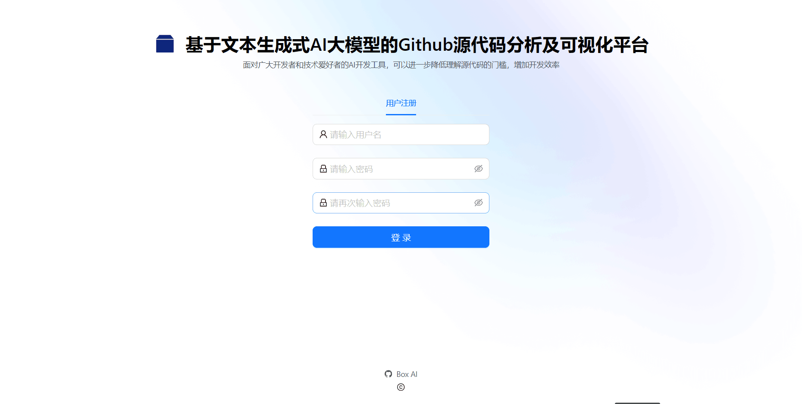

# 介绍

## 项目简介

GitHub作为全球最大的开源社区，拥有众多优秀的开源项目，2023 年总体数据来说，全域活跃仓库数量达到了 **8792万**，使用了近**500种**语言来构建软件，但是大多数在平台上的项目缺乏，良好的注释和开发手册，同时计算机专业的学生和技术爱好者者经常需要去gitub上面获取源码。

在这样的背景下广大开发者在面对一些开源项目时，**由于技术门槛或其他原因难以理解源代码，为解决这一痛点，我们倾力打造了一款基于文本生成式Al大模型的Github源代码分析及可视化平台**：可以让用户直接上传源码文件，通过AI进行分析，**不同于市面上的各类自然语言AI大模型，我们对AI模型进行了专项封装与微调，在面对大量代码时可以高效的揭示源码所运用的关键技术和框架，梳理项目依赖关系，运行构建方法等。**

## 技术栈

- Undertow
- springboot
- mybatis-plus
- druid
- Redis
- Redisson
- ant design pro

**开发工具：**

- Lombok
- Hutool
- commons-lang3
- fastjson2
- Knife4j

## 项目展示

## 项目功能设计

（1）数据与可视化模块 ：服务端进行对响应数据的可视化处理。
（2）异步化生成模块：服务端对请求进行异步化处理，让不同任务分离进行。
（3）Github源代码分析模块：在服务端进行提示词预输入、对大模型进行微调。
（4）历史记录模块：用户可以查看，修改自己的提问记录。
（5）共享数据大厅模块：用户可以查找，收藏，点赞别人分享的生成结果。
（6）个人收藏模块：用户可以查看自己收藏的帖子。
（7）登录注册模块：进行用户鉴权。
（8）个人信息管理模块：用户可以查看和修改自己的个人信息。

后端接口文档地址
<http://www.cheesevps.top:8101/api/doc.html#/home>

# 运行

## 前言

我用的idea 和webstorm来写的前后端，用自己相应的前后端编写软打开即可

## 前端

1. 环境node.js，我的版本是18.18.0
2. 建议使用yarn包管理器 npm install -g yarn ，可以使用yarn -v 看是不是安装成功
3. 打开项目，安装依赖在命令终端输入，yarn
4. 依赖安装完成 打开package.josn 文件，点击start:dev 旁边的运行
5. 在 <http://localhost:8000> 查看前端
